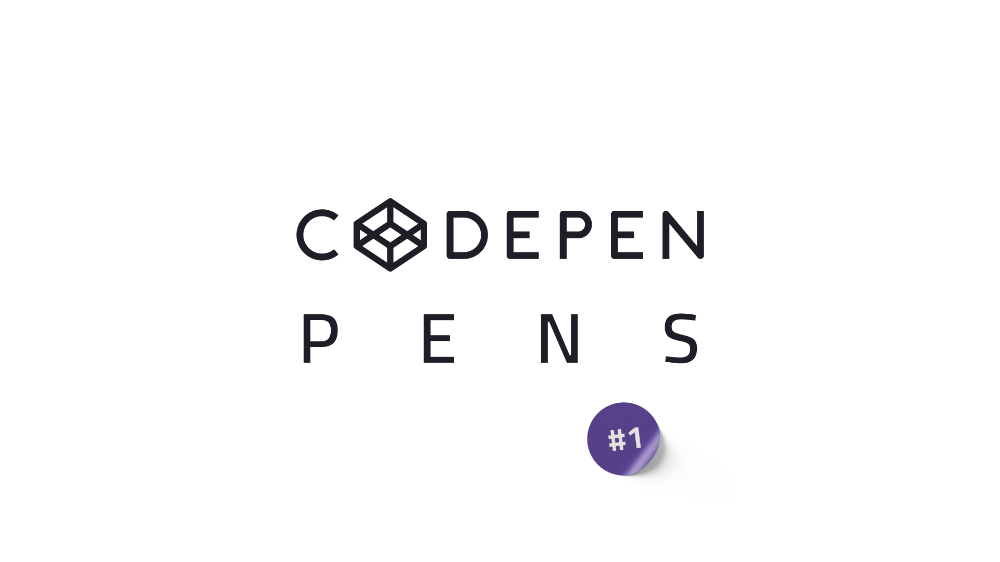

<h1 align='center'>
    
</h1>

This repo is a portfolio of my CODEPEN PENS Collections. Each collection has a thumbnail image, by clicking on the image, you will go to the collection project on Behance, and you can see the 🗃 SOURCE CODE, 👁 LIVE DEMO, AND ✨ MUCH MORE!

 

## Pens
> 👁 The collections are sorted from the latest to the oldest.

> 💡 Click on image to visit the project on Behance!

 

    <a href='https://www.behance.net/gallery/157503967/CODEPEN-PENS-Collection-1'>
        <picture title='CODEPEN PENS Collection #1'>
            <source height='200px' media='(min-width: 411px)' srcset='./images/thumbnails/1.png'>
            <source width='95%' media='(max-width: 410px)' srcset='./images/thumbnails/1.png'>
            
        </picture>
    </a>

